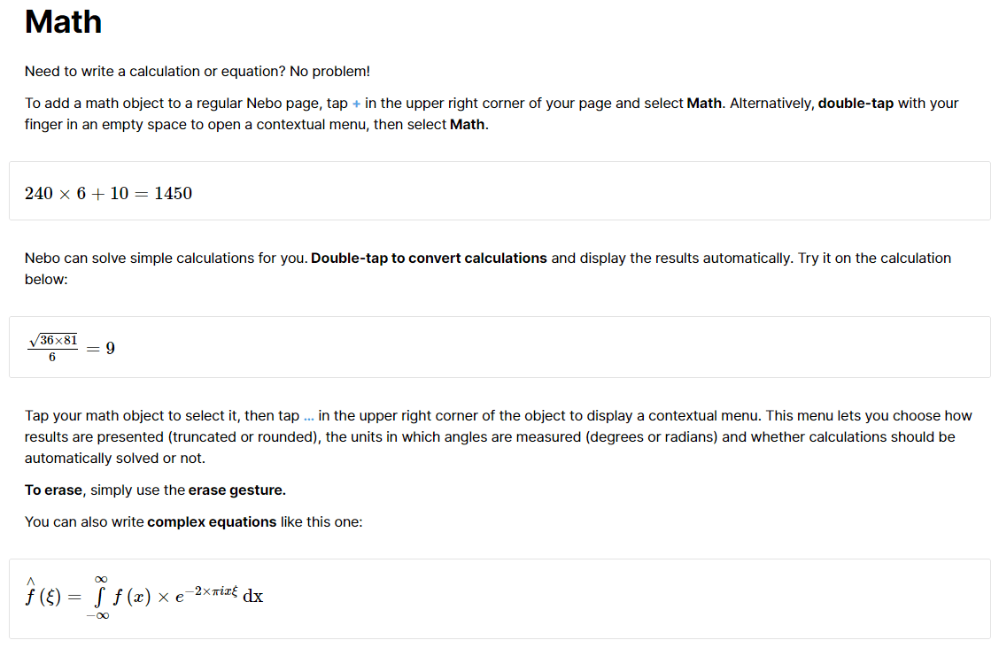
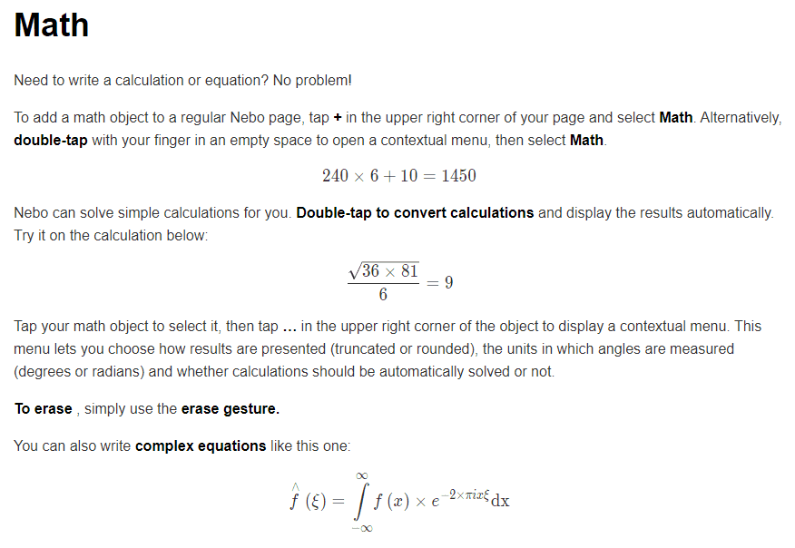

# Nebo2markdown

Convert Nebo web page to markdown.

## Install

```Bash
git clone https://github.com/Sciroccogti/Nebo2markdown
cd Nebo2markdown
pip3 install -r requirements.txt
```

## Usage

1. In your Nebo app, publish one of your page. You will get a shared link, such as mine: [Math](https://www.nebo.app/page/542fc854-3746-4cd1-b662-e2ae63147af5)
2. Open the shared link in your browser, and save the web page to local `.html`
3. `python3 ./nebo2markdown.py -i path/to/input.html -o path/to/output.md`

### Example

#### Input

[Math(html)](assets/Math.html)



#### Output

[Math(md)](assets/Math.md)



## Limitation

1. The web page is rendered by JavaScript, so we have to download it instead of fetching it directly inside python.
2. We only support plain text, and converted math formula now. That is to say, everything should be print hand, and no picture or hand script will be recognized.
